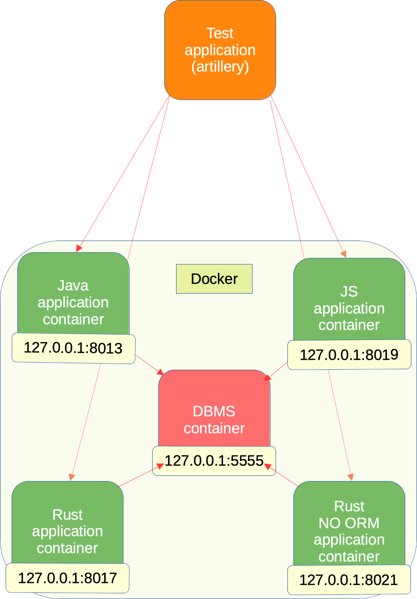

```
 _____     _                     _               
/__   \___| | ___ _ __ ___   ___| |_ _ __ _   _  
  / /\/ _ \ |/ _ \ '_ ` _ \ / _ \ __| '__| | | | 
 / / |  __/ |  __/ | | | | |  __/ |_| |  | |_| | 
 \/   \___|_|\___|_| |_| |_|\___|\__|_|   \__, | 
                                          |___/  
                    _    _                       
__      _____  _ __| | _| | ___   __ _ _ __      
\ \ /\ / / _ \| '__| |/ / |/ _ \ / _` | '_ \     
 \ V  V / (_) | |  |   <| | (_) | (_| | | | |    
  \_/\_/ \___/|_|  |_|\_\_|\___/ \__,_|_| |_|    
                                                 
 _____          _                                
/__   \___  ___| |_                              
  / /\/ _ \/ __| __|                             
 / / |  __/\__ \ |_                              
 \/   \___||___/\__|                             
                                                                                        
```
## Telemetry workloan test
Telemetry workloan test was developed for testing the applications workloan in order to allow to make a comparison between different technologies. Currently there are 4 projects on witch tests are made: Java, Rust, Rust (no ORM) and TypeScript. This project was made using turbo repo and pnpm.

### Architecture
All 4 applications that are tested are installed in 4 different docker containers. Every application connects to the fifth container that contains the DBMS.




### install pnpm
```curl -fsSL https://get.pnpm.io/install.sh | sh -```

### install packages
```pnpm install```

### run test
```pnpm run test```
