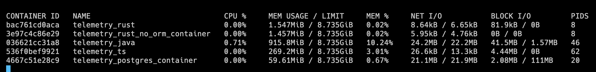

```

████████╗███████╗██╗     ███████╗███╗   ███╗███████╗████████╗██████╗ ██╗   ██╗                              
╚══██╔══╝██╔════╝██║     ██╔════╝████╗ ████║██╔════╝╚══██╔══╝██╔══██╗╚██╗ ██╔╝                              
   ██║   █████╗  ██║     █████╗  ██╔████╔██║█████╗     ██║   ██████╔╝ ╚████╔╝                               
   ██║   ██╔══╝  ██║     ██╔══╝  ██║╚██╔╝██║██╔══╝     ██║   ██╔══██╗  ╚██╔╝                                
   ██║   ███████╗███████╗███████╗██║ ╚═╝ ██║███████╗   ██║   ██║  ██║   ██║                                 
   ╚═╝   ╚══════╝╚══════╝╚══════╝╚═╝     ╚═╝╚══════╝   ╚═╝   ╚═╝  ╚═╝   ╚═╝                                 
                                                                                                            
██╗    ██╗ ██████╗ ██████╗ ██╗  ██╗██╗      ██████╗  █████╗ ███╗   ██╗    ████████╗███████╗███████╗████████╗
██║    ██║██╔═══██╗██╔══██╗██║ ██╔╝██║     ██╔═══██╗██╔══██╗████╗  ██║    ╚══██╔══╝██╔════╝██╔════╝╚══██╔══╝
██║ █╗ ██║██║   ██║██████╔╝█████╔╝ ██║     ██║   ██║███████║██╔██╗ ██║       ██║   █████╗  ███████╗   ██║   
██║███╗██║██║   ██║██╔══██╗██╔═██╗ ██║     ██║   ██║██╔══██║██║╚██╗██║       ██║   ██╔══╝  ╚════██║   ██║   
╚███╔███╔╝╚██████╔╝██║  ██║██║  ██╗███████╗╚██████╔╝██║  ██║██║ ╚████║       ██║   ███████╗███████║   ██║   
 ╚══╝╚══╝  ╚═════╝ ╚═╝  ╚═╝╚═╝  ╚═╝╚══════╝ ╚═════╝ ╚═╝  ╚═╝╚═╝  ╚═══╝       ╚═╝   ╚══════╝╚══════╝   ╚═╝   
                                                                                                                 
                          
                                                                                        
```
## Telemetry workloan test
Telemetry workloan test was developed for testing the applications workloan in order to allow to make a comparison between different technologies. Currently there are 4 projects on which tests are made: Java, Rust, Rust (no ORM) and TypeScript. This project was made using turbo repo and pnpm.

### Architecture
All 4 applications that are tested are installed in 4 different docker containers. Every application connects to the fifth container that contains the DBMS (Postgres).


### Development stack
 - Java application: Java, Spring Boot, Hibernate, Postgres
 - TS pplication: Typescript, Express, TypeORM, Postgres
 - Rust application: Rust, Warp, Sea-ORM, Postgres
 - Rust (no ORM) application: Rust, Warp, sqlx, Postgres

### Install pnpm
```curl -fsSL https://get.pnpm.io/install.sh | sh -```

### Install packages
```pnpm install```

### Run test
```pnpm run test```

### Tests results
Tests results  are under the directory `apps/telemetry_test/reports-html`. 

### Meaning of tests by directory
 - `kread` - constant number of v-users that makes requests that executes a select. Aim: determinate percentile value. 
 - `kwrite` - constant number of v-users that makes requests that executes an insert. Aim: determinate percentile value.
 - `kwriteread` - constant number of v-users that makes requests that executes an insert and a select. Aim: determinate percentile value.
 - `read` - variable number of v-users that makes reqeusts that execute a select. Aim: determinate the workloan.
 - `write` - variable number of v-users that makes reqeusts that execute an insert. Aim: determinate the workloan.
 - `writeread` - variable number of v-users that makes reqeusts that execute am insert and a select. Aim: determinate the workloan.

### Opinion on tests
Taking into account the various tests I have done, Rust applications seems that has better results. Rust ORM accepts less requests than Rust NO ORM (yes, could be obvius). Furthermore the memory usage of rust applications is lower thant the others (1.5Mb vs about 1Gb of java application, see the `docker stats` result). 
So that, Rust rocks!


### Moreover
 - the select involves the execution of a query with a subquery and a group by statement.
